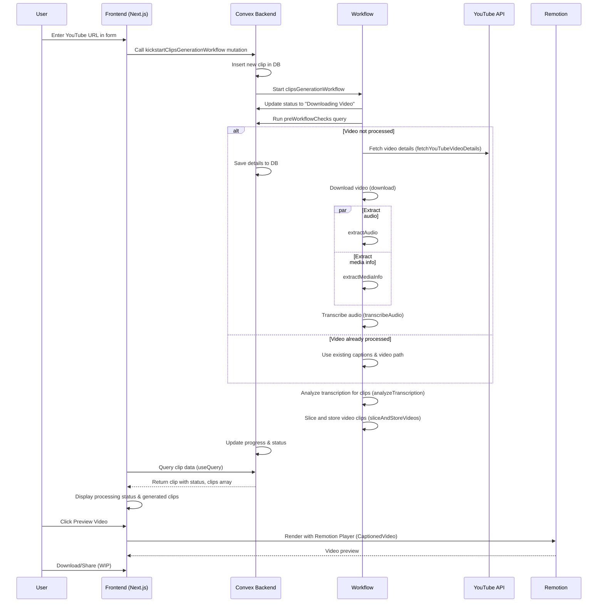

# Architecture

## State Flow Diagram

```mermaid
sequenceDiagram
    participant U as User
    participant F as Frontend (Next.js)
    participant C as Convex Backend
    participant W as Workflow
    participant YT as YouTube API
    participant R as Remotion

    U->>F: Enter YouTube URL in form
    F->>C: Call kickstartClipsGenerationWorkflow mutation
    C->>C: Insert new clip in DB
    C->>W: Start clipsGenerationWorkflow
    W->>C: Update status to "Downloading Video"
    W->>C: Run preWorkflowChecks query
    alt Video not processed
        W->>YT: Fetch video details (fetchYouTubeVideoDetails)
        C->>C: Save details to DB
        W->>W: Download video (download)
        par Extract audio
            W->>W: extractAudio
        and Extract media info
            W->>W: extractMediaInfo
        end
        W->>W: Transcribe audio (transcribeAudio)
    else Video already processed
        W->>W: Use existing captions & video path
    end
    W->>W: Analyze transcription for clips (analyzeTranscription)
    W->>W: Slice and store video clips (sliceAndStoreVideos)
    C->>C: Update progress & status
    F->>C: Query clip data (useQuery)
    C-->>F: Return clip with status, clips array
    F->>F: Display processing status & generated clips
    U->>F: Click Preview Video
    F->>R: Render with Remotion Player (CaptionedVideo)
    R-->>F: Video preview
    U->>F: Download/Share (WIP)
```
